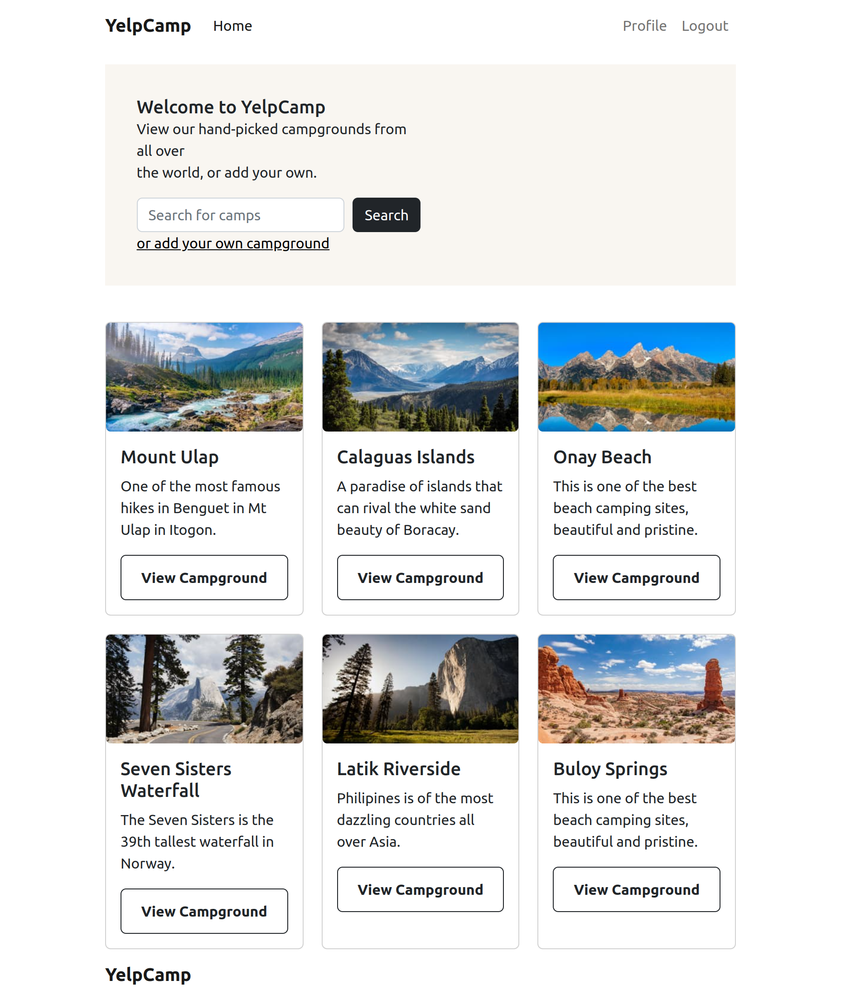

# YELP CAMP

Yelp Camp is a web-based camping, hiking, backpacking, overlanding application to enable users explore various camping destinations. 

It is a simple dashboard/landing page respresentation that displays various camping destinations. 

This project was bootstrapped with [Create React App](https://github.com/facebook/create-react-app).

## Screenshot


## Installation
Guide to install Yelp Camp setup.

To clone this repo, run:
```bash
git clone git@github.com:John-Kimani/yelp-camp.git
```
Move into the cloned directory:
```bash
    cd yelp-camp
```
Open application with your editor, for example, using visual studio code run:
```bash
code .
```

Install and or update project dependancies to your local development server:
```bash
npm install
```

Run react application
```bash
npm start
```

## Technologies used
- React framework for the user interface.
- TypeScript for programming.


- Bootstrap and react bootstrap.
- Database: Firebase enabled with Sign In with Google.

## Deployment
---

